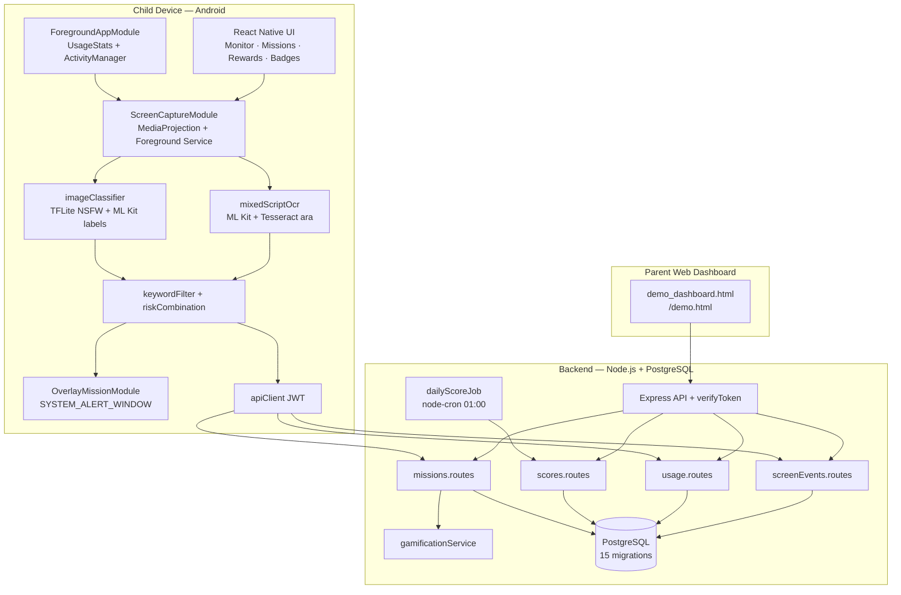

# Pre-Final Technical Report

**Project:** AI Parental Control Platform (SafeGuard)  
**Author:** Helmi Megdiche — ESPRIT (5th year PFE)  
**Internship period:** 01/02/2026 – 31/07/2026  
**Repository:** [github.com/Helmi-Megdiche/PFE](https://github.com/Helmi-Megdiche/PFE)  
**Release reference:** tag `v1.0-final` — commit `59da85b` (5 June 2026)  
**Document version:** 1.0 (pre-final)

---

## Table of Contents

1. [Executive Summary / Problem Statement](#1-executive-summary--problem-statement)
2. [System Architecture](#2-system-architecture)
3. [Implementation Highlights](#3-implementation-highlights)
4. [Limitations of the Entire System](#4-limitations-of-the-entire-system)
5. [Future Work](#5-future-work)
6. [Conclusion](#6-conclusion)
7. [Appendix A — Test Coverage Summary](#appendix-a--test-coverage-summary)
8. [Appendix B — API Surface (v1.0-final)](#appendix-b--api-surface-v10-final)

---

## 1. Executive Summary / Problem Statement

### 1.1 Problem context

Two *cahiers des charges* (specification documents) for this PFE internship converge on the same underlying crisis: **children's smartphone use has outpaced the protective capacity of traditional parental-control tools**. Parents can block apps or set timers, but these mechanisms do not address:

- **Behavioural addiction** — compulsive checking, night scrolling, week-over-week escalation, and imbalance between screen time and real-world activity.
- **Exposure to dangerous content** — violent media, toxic social interactions, adult material, and dangerous online challenges that appear inside browsers and social apps rather than in easily blocklisted packages.
- **Lack of educational intervention** — restriction without guidance leaves children without skills to self-regulate or understand why certain content is harmful.

Existing market solutions emphasise **restriction** (blacklists, time limits, geofencing) rather than **intelligence** (understanding what the child is doing, scoring risk, and responding with age-appropriate educational missions).

### 1.2 Project goal

SafeGuard is an **intelligent parental-control layer** that combines:

| Pillar | Implementation |
|--------|----------------|
| **On-device AI** | OCR, TFLite NSFW classification, ML Kit image labeling — screenshots never leave the device in production |
| **Risk scoring** | Per-capture combined risk (OCR + vision) and daily addiction / wellbeing scores from usage sessions |
| **Real-world missions** | Quizzes, mini-games, cognitive exercises, and parent-approved physical/social tasks triggered by risk or unhealthy usage |
| **Gamification** | Points, levels, smart badges, and parent-defined rewards |
| **Parent visibility** | Web dashboard for scores, events, mission approval, interests, and rewards |

The system is implemented as a **privacy-first Android child application** (React Native 0.74.5), a **Node.js + PostgreSQL backend**, and a **static parent web dashboard** served at `/demo.html`. At release `v1.0-final`, the repository has been cleaned for delivery: the offline ML training pipeline and iOS scaffold were removed; the shipped product is **Android-only** with archived training assets kept locally by the author.

### 1.3 Achievements at v1.0-final

By commit `59da85b`, the project delivers an end-to-end demonstrable pipeline:

1. Adaptive screen capture with app-aware intervals and MIUI foreground attribution fixes.
2. Multilingual on-device OCR (English, French, Arabic script, Tunisian Derja Arabizi).
3. Combined risk scoring with Yahoo Open NSFW TFLite and ML Kit label heuristics.
4. Automatic mission generation with cooldown resurface, overlay presentation on third-party apps, and parent approval workflow.
5. Daily cron scoring with dynamic wellbeing proxies (physical activity, bedtime variance, family interaction).
6. **290 automated unit tests** (162 mobile + 128 backend) plus smoke scripts for integration validation.

The final capture/mission commit (`59da85b`) specifically addresses production-blocking bugs discovered during physical-device testing on MIUI: capture pipeline stalls after risky detections, mission overlays appearing only inside SafeGuard instead of on Messenger/Chrome, and cooldown behaviour that blocked overlays without re-presenting completed missions.

---

## 2. System Architecture

`PROJECT_ARCHITECTURE.md` is not present in the repository; architecture is documented in root `README.md` and inferred from the codebase structure below.

### 2.1 High-level architecture



### 2.2 Subsystem breakdown

#### 2.2.1 Android child app (`MobileApp/`)

| Layer | Key paths | Role |
|-------|-----------|------|
| **UI & navigation** | `src/navigation/MainTabs.tsx`, `src/screens/*` | Monitor toggle, mission games, rewards store, badges, profile |
| **Capture orchestration** | `src/hooks/useScreenshotCapture.ts` | Adaptive intervals, debounce, OCR/vision pipeline, API post, mission presentation |
| **Foreground tracking** | `src/hooks/useRealForegroundTracker.ts`, `src/native/ForegroundApp.ts` | Usage session batching (`POST /api/usage` every 60s) and capture-time package resolution |
| **Native Android** | `android/.../screencapture/`, `foreground/`, `overlay/` | MediaProjection, UsageStats, overlay window |
| **Missions** | `src/missions/presentMissionFromCapture.ts`, `src/hooks/useMissionOverlayListener.ts` | Overlay-first presentation, escape penalty, enforcement resurface |
| **Services** | `src/services/mixedScriptOcr.ts`, `nsfwClassifier.ts`, `imageClassifier.ts` | On-device AI stack |

The app requires **MediaProjection** consent, a persistent **foreground-service notification** (Android 14+), optional **Usage Access** for accurate `appPackage`, and **Display over other apps** for mission overlays on third-party applications.

#### 2.2.2 Backend API (`backend/`)

| Module | Key paths | Role |
|--------|-----------|------|
| **Routing** | `src/routes/index.ts` | JWT-protected `/api/*` except `/health`, `/dev/*`, `/debug/*` |
| **Screen events** | `src/routes/screenEvents.routes.ts` | Store metadata; trigger `generateMissionFromRisk`; cooldown resurface |
| **Scoring** | `src/scoring/scoringEngine.ts`, `aggregateUsage.ts`, `wellbeingProxies.ts` | Addiction/wellbeing formulas; dynamic proxy fetchers |
| **Cron** | `src/jobs/dailyScoreJob.ts` | Nightly aggregation for all children |
| **Missions** | `src/services/missionGenerator.ts`, `missionHelpers.ts` | Decision tree, templates, adaptive threshold, escalation |
| **Gamification** | `src/services/gamificationService.ts` | Badge evaluation, age-band cleanup |
| **Database** | `src/db/migrations/000_init.sql` … `015_badge_cleanup.sql` | 15 sequential migrations |

The backend compiles TypeScript to `dist/` for production (`npm run build && npm start`). Development uses `tsx watch src/index.ts`.

#### 2.2.3 Parent web dashboard

| Artifact | Path | Notes |
|----------|------|-------|
| Source | `demo_dashboard.html` (repo root) | Editable source |
| Served copy | `backend/public/demo.html` | Synced via `npm run sync:demo` |
| Access | `http://localhost:3000/demo.html` | Requires parent JWT from `/api/dev/parent-token` in development |

The dashboard provides **Monitoring** and **Parent** tabs: screen events, usage/scores trends, mission approval/reject, bonus points, rewards management, badge display, and a **checkbox-only interests picker** (five predefined tags — no free-text input).

### 2.3 End-to-end data flow

```mermaid
sequenceDiagram
    participant Child as Child App
    participant Device as On-Device AI
    participant API as Backend API
    participant DB as PostgreSQL
    participant Parent as Parent Dashboard

    Child->>Child: MediaProjection capture (JPEG temp)
    Child->>Device: ML Kit OCR (+ Tesseract if Arabic)
    Child->>Device: TFLite NSFW + ML Kit labels
    Device->>Child: combinedRiskScore, category
    Child->>Child: Delete JPEG; truncate text ≤500 chars
    Child->>API: POST /api/screen-events (metadata only)
    API->>DB: INSERT screen_events
    API->>API: generateMissionFromRisk / resurface cooldown
    API-->>Child: newMission + reSurfaced flag
    Child->>Child: Overlay on foreground app (if risky)
    Child->>API: POST /api/missions/:id/complete
    API->>DB: status pending_approval (real_world)
    Parent->>API: POST /api/missions/:id/approve
    API->>DB: award points; status completed
    Note over API,DB: dailyScoreJob at 01:00 aggregates usage + proxies
    Parent->>API: GET /api/scores/:childId/trend
```

**Privacy invariant:** production `POST /api/screen-events` transmits **text preview and scores only**. Debug routes (`POST /api/debug/classify`, `POST /api/debug/arabic-ocr`) accept image uploads for supervisor validation — these are disabled in production builds and are not used by the child app.

---

## 3. Implementation Highlights

This section documents **what** each component does (with file references), **why** the approach was chosen, and **known limitations** of that specific design choice.

### 3.1 Screen capture

**What it does**

Screen capture is implemented through a native Java module (`ScreenCaptureModule`) using Android's **MediaProjection API**, wrapped by the React hook `useScreenshotCapture.ts` (≈1,100 lines at v1.0-final).

Core constants from the hook:

```65:84:MobileApp/src/hooks/useScreenshotCapture.ts
const APP_POLL_MS = 1_000;
const CAPTURE_DEBOUNCE_MS = 5_000;
const FOLLOW_UP_DELAY_MS = 5_000;
/** Skip follow-up if a capture completed within this window. */
const FOLLOW_UP_MIN_GAP_MS = 2_000;
// ...
const VISION_PIPELINE_TIMEOUT_MS = 25_000;
const FOREGROUND_LOOKUP_TIMEOUT_MS = 2_500;
const API_POST_TIMEOUT_MS = 12_000;
/** Force-release OCR lock if a frame handler never settles (prevents permanent capture stall). */
const FRAME_PROCESSING_WATCHDOG_MS = 25_000;
```

**Adaptive capture (Sprint 3.7)** replaces a fixed 30-second interval:

| Trigger | Behaviour |
|---------|-----------|
| App switch | `AppState` background when leaving SafeGuard + 1s UsageStats poll; effective foreground uses `com.mobileapp` while SafeGuard is active (UsageStats excludes own package) |
| Follow-up | 5 seconds after switch, unless a capture completed within 2 seconds |
| Periodic | Rolling average of last 3 `combinedRiskScore` values → 10s / 30s / 60s |

**App-aware intervals** (`MobileApp/src/utils/appCapturePolicy.ts`) further adjust the JS periodic timer: browsers/social apps cap at 30s; games and launchers use app-switch-only (interval 0); education apps stretch to ≥120s.

**Why this approach**

- **Battery vs. responsiveness trade-off:** fixed-interval capture wastes power on low-risk home screens and reacts too slowly after a risky browser session. Adaptive + app-aware scheduling concentrates captures where risk is statistically higher.
- **Platform constraint:** MediaProjection requires a visible foreground service on Android 14+; the native 60s loop remains as a safety net while JS timers implement smarter scheduling.
- **Post-mission stability (v1.0-final):** overlay is shown **before** capture pauses (`presentMissionFromCapture.ts`) so MIUI does not attribute frames to SafeGuard; a 25s processing watchdog and generation token prevent `isProcessing` from blocking the pipeline indefinitely after hung native/API calls.

**Limitations**

- Periodic capture still consumes battery; adaptive logic reduces but does not eliminate cost.
- Native `startCapture(60s)` may still deliver frames independent of JS interval-0 categories.
- **5-second native debounce** (JS + `ScreenCaptureModule.captureNow`) means very fast app switches within 5s may skip an immediate frame; follow-up (~5s) or the adaptive periodic timer usually captures within ~5–30s.
- **Blank/loading Chrome tabs** produce neutral scores (Sky/Space labels, little OCR) — wait for the page to load before app-switch capture.
- MIUI may briefly attribute `com.miui.home` on the app drawer; OCR inference corrects package for Messenger/Chrome/WhatsApp when UI text is visible.
- MediaProjection consent is sensitive; revoking it stops the entire pipeline.

---

### 3.2 Foreground app detection

**What it does**

`ForegroundAppModule.java` resolves the foreground package via **UsageStatsManager** (120-second UsageEvents window, 5-second recency filter on `queryUsageStats` fallback) with **ActivityManager** fallback when Usage Access is denied.

```35:38:MobileApp/android/app/src/main/java/com/mobileapp/foreground/ForegroundAppModule.java
    /** UsageEvents: look back far enough to survive 60s capture intervals. */
    private static final long USAGE_EVENTS_WINDOW_MS = 120_000L;
    /** queryUsageStats fallback: ignore apps not used in the last few seconds. */
    private static final long USAGE_STATS_RECENCY_MS = 5_000L;
```

The TypeScript wrapper (`MobileApp/src/native/ForegroundApp.ts`) serializes concurrent `getCurrentForegroundApp` calls (single-flight) to avoid React Native bridge stalls — a fix shipped in `59da85b`.

At capture time, `resolveForegroundAppWithRetry()` performs up to three lookups; launcher and `com.android.systemui` packages are never reported. If live lookup fails, a poll cache (max 120s during mission grace, 15s otherwise) is used.

**MIUI attribution override (v1.0-final):** when UsageStats reports `com.miui.home` or a stale package (e.g. Messenger cached while Chrome is visible), `inferAppPackageFromOcr.ts` infers the real app from OCR patterns (Chrome URL bar, Messenger chat headers, Instagram UI). `shouldOverridePackageWithOcrInference()` gates when override is safe.

**Why this approach**

- UsageStats is the only reliable Android API for cross-app foreground detection without accessibility services (which raise store-policy and privacy concerns).
- OCR override is a pragmatic fix for OEM bugs (Xiaomi MIUI) where UsageStats returns the launcher or previous app during recents-widget and split-focus scenarios.

**Limitations**

- Usage Access is optional; without it, ActivityManager fallback is less accurate.
- OCR inference can mis-attribute if UI text is ambiguous or generic.
- iOS has no equivalent module; the project does not ship an iOS capture stack.
- Launcher packages are excluded from reporting — correct for attribution but requires OCR override to avoid missing risky browser content mislabeled as home.

---

### 3.3 OCR (multilingual)

**What it does**

`mixedScriptOcr.ts` implements a **strictly sequential** hybrid pipeline:

1. **ML Kit Text Recognition** — fast path for Latin script (English, French, Arabizi).
2. **`cleanOcrText.ts`** — strips UI noise (timestamps, like counts, social chrome).
3. **`normalizeArabizi.ts`** — digit-letter mapping for Tunisian Derja keyword matching.
4. **Tesseract `ara` fallback (Android only)** — `mobileArabicOcr.ts` via `@devinikhiya/react-native-tesseractocr` when Arabic script or garbled Latin-from-Arabic is detected (`arabicOcrTrigger.ts`).

```1:10:MobileApp/src/services/mixedScriptOcr.ts
/**
 * Hybrid OCR — ML Kit first, optional on-device Arabic Tesseract fallback.
 *
 * Flow is strictly sequential:
 * 1) ML Kit runs first (fast path, FR/EN/Arabizi)
 * 2) On Android, run Tesseract (ara) when ML Kit output has Arabic script OR
 *    strong Arabizi without Arabic Unicode (garbled Latin from Arabic pages)
 *
 * This avoids ML Kit/Tesseract concurrency and keeps non-Arabic captures fast.
 */
```

Keyword matching uses `keywordFilter.ts` with parallel lists in `constants/riskKeywords.ts` (English, French, Arabic, Derja) on both mobile and backend debug paths.

**Why this approach**

- **Privacy:** all production OCR runs on-device; only ≤500 characters of extracted text are transmitted.
- **Performance:** ML Kit is fast for Latin; Tesseract is invoked only when Arabic is likely, avoiding 25s penalties on English-only frames.
- **Regional requirement:** Tunisian Derja often appears as Arabizi in Latin script on social apps; normalization enables keyword hits without Arabic Unicode.

**Limitations**

- ML Kit does **not** reliably recognise Arabic script on all devices; Tesseract compensates but is **slow** (up to 25s, capped by `VISION_PIPELINE_TIMEOUT_MS`).
- Tesseract can **hallucinate** Arabic characters on substantial Latin pages; the pipeline explicitly guards against this.
- Low-resolution thumbnails (MIUI recents widgets) produce poor OCR; launcher-widget captures may be neutralized (`launcherCaptureContext.ts`).
- Noisy social UI still produces false positives/negatives despite `cleanOcrText`.
- Debug Arabic OCR on the server (`POST /api/debug/arabic-ocr`) uses different preprocessing than on-device — scores may differ.

---

### 3.4 Vision classification

**What it does**

`imageClassifier.ts` orchestrates:

| Source | Module | Role |
|--------|--------|------|
| **TFLite NSFW** | `nsfwClassifier.ts` + native `NsfwTflite` | Yahoo Open NSFW model (`nsfw.tflite`, 224×224); adult/suggestive/neutral |
| **ML Kit Image Labeling** | `@react-native-ml-kit/image-labeling` | Violence, gore, weapons, drugs, educational cues |
| **Heuristic mapping** | `riskMapping.ts` (shared mobile + backend) | Label → category weights |

```20:48:MobileApp/src/utils/riskCombination.ts
export function computeOcrRiskScore(
  riskFlag: boolean,
  category: RiskCategory,
  matchedCount: number,
): number {
  // category-specific floors for adult/violent
}
// ...
export function combineRiskScores(
  ocrRiskScore: number,
  imageRiskScore: number,
): number {
  return Math.round(
    Math.min(100, Math.max(0, ocrRiskScore * OCR_WEIGHT + imageRiskScore * IMAGE_WEIGHT)),
  );
}
```

TFLite owns adult/suggestive classification; ML Kit boosts non-adult risk only when TFLite score &lt; 50. `applyExplicitOcrBoost` raises image risk when OCR finds explicit adult keywords but vision is timid.

**Why this approach**

- **On-device inference** avoids uploading screenshots (GDPR/COPPA alignment).
- Yahoo Open NSFW TFLite is lightweight and RN-0.74-compatible; a custom EfficientNet fine-tune (Sprint 3.8) was explored but the repo ships the Yahoo model for stability.
- ML Kit labels add violence/gore signal without training a multi-head model on-device.

**Limitations**

- Not YOLO/CLIP-level semantic understanding; keyword-heavy OCR still drives many category decisions.
- TFLite NSFW is binary-ish (porn/sfw); hentai, contextual nudity in medical/educational settings, and video motion are not modelled.
- ML Kit label mapping is **heuristic** — false labels on memes, game screenshots, and news images occur.
- Backend debug uses **nsfwjs** (TensorFlow.js) — different numerics from on-device TFLite; dashboard debug scores ≠ production child-app scores.
- Model rebuild required after `nsfw.tflite` changes (`npm run android`).

---

### 3.5 Risk scoring

**What it does**

**Per-capture risk (mobile, real-time)**

| Component | Weight | Source |
|-----------|--------|--------|
| OCR risk | 30% | `computeOcrRiskScore` from keyword hits + category |
| Vision risk | 70% | TFLite + ML Kit via `computeImageRiskScore` |
| Combined | — | `combineRiskScores`; post-processing overrides in `riskCombination.ts` |

Additional mobile-only rules:

- **Filtered SERP cap** (`riskySearchContext.ts`): Google/Bing SafeSearch pages cap combined risk unless explicit search-box query detected.
- **Launcher widget neutralization** (`launcherCaptureContext.ts`): recents-thumbnail-only captures stored as neutral.
- **Benign context** (`benignRiskContext.ts`): skips reporting for known false-positive patterns.

**Daily addiction score (backend cron)**

`scoringEngine.ts` computes five weighted components (intensity 30%, compulsivity 20%, night usage 25%, escalation 15%, real imbalance 10%) from aggregated `usage_sessions`. The daily job adds an **exposure penalty**: `min(20, weeklyRiskyCount × 2)` from `screen_events` where `risk_flag = true` in the last 7 days.

**Daily wellbeing score**

Five components: screen balance 30%, content quality 25%, real activity 20%, sleep consistency 15%, family interaction 10%. Content quality uses `educationalScreenMinutes / totalMinutes` from **usage session app categories**, not live OCR educational classification.

**Why this approach**

- Splitting OCR/vision weights reflects that thumbnails and UI text often carry stronger adult/violence signals than coarse image classifiers on phone screenshots.
- Usage-based daily scores capture behavioural addiction patterns invisible to single frames.
- Exposure penalty links screen-content events to longitudinal addiction scoring.

**Limitations**

- Keyword-heavy OCR drives many high-risk events; vision can be overridden but not replaced.
- Educational content quality proxy uses **app category** (e.g. Khan Academy package) not what the child is actually viewing inside the app.
- Exposure penalty is sensitive to false-positive risky events (noisy OCR in dev databases can inflate addiction).
- Scores update on **daily cron** (01:00 server local), not live.
- Date boundaries use **UTC** — may misalign with family local timezone for night-usage and score dates.
- Component columns in `daily_scores` store base addiction components; exposure penalty is applied only to the stored `addiction_score` field.

---

### 3.6 Mission generation

**What it does**

Mission generation is triggered from:

| Source | Condition | Function |
|--------|-----------|----------|
| `POST /api/screen-events` | `combinedRiskScore != null` | `generateMissionFromRisk` |
| Daily cron | `wellbeingScore < 40` or `addictionScore > 70` | `dailyScoreJob.ts` |
| Mobile | `POST /api/missions/suggest` | Same rules (default score 75) |

**Decision tree** (`pickMissionTemplate` in `missionGenerator.ts`):

```381:410:backend/src/services/missionGenerator.ts
  if (input.triggerReason === 'high_addiction' || input.addictionScore > 70) {
    picked = pickCandidate(['nback', 'tower', 'digital_detox'], ...);
  } else if (input.triggerReason === 'low_wellbeing' || input.wellbeingScore < 40) {
    picked = pickCandidate(['physical_activity', 'family_interaction'], ...);
  } else if (input.triggerReason === 'risky_content' || ...) {
    const templateKeys = RISK_CATEGORY_TEMPLATES[normalized] ?? ...;
    picked = pickCandidate(templateKeys, ...);
  } else {
    picked = pickCandidate(['physical_activity', 'family_interaction', 'tictactoe', 'sudoku'], ...);
  }
```

**Smart rules (Sprint 4.5+)**

- **Adaptive threshold:** 7-day average `combined_risk_score` + 10, clamped 50–80.
- **Cumulative burst:** sum of last 5 scores in 30 minutes &gt; 300 (minimum 3 events).
- **Category mapping:** adult → safety quiz / games / detox; violent → media-violence quiz; toxic → kindness; dangerous_challenge → safety talk.
- **Escalation:** +30% points per level after every 3 `risky_content` missions in 24h (max +60%).
- **Caps:** max 3 pending missions; 24-hour expiry; cooldown (`MISSION_RISK_COOLDOWN_MINUTES`, default 15 prod / 2 dev).

**Cooldown resurface (pre-integration):** `getResurfaceableRiskyMission` returns `pending`, re-opens `failed`, or overlay-only resurface of **completed quiz/cognitive** missions — not `pending_approval` or completed **real_world**. Mobile applies a **60s** minimum gap between re-surfaced overlays (`missionPresentationGuard.ts`). Benign OCR for Messenger/WhatsApp inbox and explicit Google omnibar `nsfw` (`hasExplicitAdultGoogleSearchIntent`) reduce false positives on social home screens and Fiverr SERP body text.

**Interest tie-breaker:** `INTEREST_TAG_MAP` maps parent-selected tags (`sports`, `art`, `reading`, `family`, `brain`) to template keys; `pickCandidate` prefers interest-matching templates **only when multiple candidates remain after freshness filtering**. Priority order addiction &gt; wellbeing &gt; risk category is unchanged.

**Why this approach**

- Separating triggers (content vs. behaviour vs. daily scores) matches the dual cahier requirements: dangerous content reactivity and longer-term addiction/wellbeing intervention.
- Adaptive threshold personalises sensitivity without per-child ML training.
- Cooldown resurface prevents children from bypassing enforcement by completing a quiz then immediately returning to risky content.

**Limitations**

- Interest personalization is a **tie-breaker only** — cannot override addiction/wellbeing priority.
- Five fixed interest tags; no free-form hobbies or ML-inferred interests.
- Template selection within a pool is still **random** among matches.
- Max 3 pending missions and cooldown can feel repetitive.
- Custom parent missions (`action: custom`) merge into pools but do not count toward physical-activity wellbeing proxy.

---

### 3.7 Gamification

**What it does**

| Feature | Implementation |
|---------|----------------|
| **Points** | Awarded on mission completion; escape penalty −10 (`POST /api/missions/:id/abandon`) |
| **Levels** | `floor(totalPoints / 500) + 1` returned by `GET /api/scores/:childId` |
| **Badges** | `gamificationService.ts` — mission counts, cognitive milestones, age-band badges, wellbeing streaks; legacy duplicates removed in migration `015_badge_cleanup.sql` |
| **Rewards** | Parent-created catalog; child claims via `POST /api/rewards/:id/claim` |
| **Parent bonus** | `POST /api/bonus/child/:childId` |
| **Smart difficulty** | `gameStats.ts` in AsyncStorage adjusts N-back level, tic-tac-toe AI, sudoku clues |

**Mission types** with real interactive UI in `MobileApp/src/screens/missions/`:

- **Quiz** — `QuizScreen.tsx` + `quizBank.ts` / DB-seeded questions
- **Mini-games** — Tic-Tac-Toe (minimax hard), Sudoku 4×4, Tower of Hanoi
- **Cognitive** — N-back, reaction time
- **Real-world** — honour-system confirmation → `pending_approval` → parent approve/reject

**Overlay presentation:** `OverlayMissionModule` (Java) draws above third-party apps when `SYSTEM_ALERT_WINDOW` is granted; otherwise notification + in-app `MissionScreen` fallback.

**Why this approach**

- Gamification converts punitive blocking into engagement — aligned with educational intervention goal.
- Parent approval for real-world missions introduces family involvement without automated surveillance of physical activity.
- On-device `gameStats` keeps cognitive difficulty responsive without extra API calls.

**Limitations**

- Real-world completion is **honour system** — no photo proof, geofence, or step counter.
- `gameStats` does not sync across devices or reinstalls.
- Escape penalty applies to home/app switch abandonment; **force-close does not** trigger penalty; no server-side auto-fail timeout for abandoned overlays.
- Quiz bank is curated/static + DB seeds — not a parent-facing CMS.

---

### 3.8 Wellbeing scoring (dynamic proxies — Sprint 5.8)

**What it does**

`wellbeingProxies.ts` feeds dynamic values into `computeWellbeingScore`:

| Proxy | SQL source | Mapping |
|-------|------------|---------|
| **Physical activity** | Completed `real_world` missions with physical template/actions on score date | 10 min each, max 60 |
| **Bedtime variance** | `STDDEV` of daily last `usage_sessions.end_time` over 7 days | Sleep consistency component |
| **Family interaction** | Completed family-template missions on score date | `count × 10`, max 100 |
| **Recommended screen cap** | Age from `children.birth_year` | &lt;10 → 120 min; 10–12 → 150; 13+ → 180 |

Real-world missions count **only after parent approval** (`status = 'completed'`, `completed_at` on score date). `pending_approval` does not affect that day's wellbeing score.

**Why this approach**

- Wearables and sleep sensors were out of scope; mission-completion proxies connect the gamification loop to wellbeing scoring without new hardware.
- Age-based screen caps encode paediatric guidance into the screen-balance component.

**Limitations**

- Proxies are **not ground truth** — completing a jumping-jacks mission ≠ 10 minutes of verified exercise.
- Bedtime variance uses session **end time** stddev without **midnight wrap-around**; sparse data falls back to 30 minutes → sleep score often appears optimistically high.
- Family interaction counts mission completions, not actual calls/messages.
- Custom missions do not increment physical-activity proxy.

---

### 3.9 Parent dashboard

**What it does**

`demo_dashboard.html` is a self-contained HTML/JS/Tailwind application providing:

- **Monitoring tab:** screen events table, risk filters, live polling (~30s)
- **Parent tab:** child profile (static client-side map), latest scores/level/points, badge ranks guide, mission history, approval/reject actions, rewards CRUD, claimed rewards history, bonus points
- **Interests picker:** checkbox UI for five allowed tags; Joi-validated `PUT /api/child/interests`
- **Debug tools:** Arabic OCR upload, classify upload (backend-only pipelines)

Authentication uses `fetchWithAuth` with parent JWT stored in `localStorage`. Child ID is a manual text input — single-child demo pattern.

**Why this approach**

- Rapid iteration for PFE demo without building a separate parent React Native app.
- Same origin as API (`backend/public/`) avoids CORS complexity in development.

**Limitations**

- Web-only — not an installable parent mobile app.
- **Polling** instead of push notifications (no FCM).
- Child name/age from static JS map, not `GET /api/children/:id`.
- No multi-child picker; no recommendation engine or weekly parent tips report.

---

### 3.10 Testing

**What it does**

| Layer | Framework | Count (v1.0-final) |
|-------|-----------|---------------------|
| Mobile unit tests | Jest 29 (`MobileApp/__tests__/`) | **162 tests**, 21 suites |
| Backend unit tests | Jest (`backend/tests/`) | **128 tests**, 17 suites |
| Combined runner | `scripts/run-all-tests.ps1` | Mobile + backend sequential |
| Smoke scripts | `smoke-missions.ps1`, `smoke-sprint58.ts`, `test-sprint59.ts` | API integration against running server + seeded DB |

Representative mobile test areas: `normalizeArabizi`, `keywordFilterMultilingual`, `riskMapping`, `adaptiveCapture`, `launcherCaptureContext`, `inferAppPackageFromOcr`, `missionPresentationGuard`, `gameLogic`, `nsfwClassifier`.

Representative backend test areas: `scoringEngine`, `wellbeingProxies`, `missionGenerator`, `gamificationService`, `resurfaceCooldown`, `missionsApproval`, `arabicOcr` (debug).

`MobileApp/TESTING.md` documents manual device test plans (MediaProjection, overlay permission, LAN connectivity).

**Why this approach**

- Pure functions (`pickMissionTemplate`, `computeAddictionScore`, `riskCombination`) are highly testable and document expected behaviour for the jury.
- Smoke scripts validate end-to-end API contracts beyond isolated unit tests.

**Limitations**

- No automated on-device UI tests (Detox/Appium not integrated).
- Smoke tests depend on dev DB state (pre-existing missions affect counts).
- Native Java modules (`ForegroundAppModule`, `NsfwTflite`) rely on manual device validation.
- Formal `testing_strategy.md` referenced in README is not yet written.

---

## 4. Limitations of the Entire System

The following limitation map was produced during pre-final review and is organised by category. It reflects the **honest boundaries** of v1.0-final — not aspirational roadmap items.

### 4.1 Product shape and integration

| Limitation | Detail |
|------------|--------|
| **Not plugged into “existing” parent/child apps** | The cahier assumes two pre-existing mobile apps. The deliverable is one **child** React Native app and a **web** parent dashboard — not a native parent app or host-product integration layer. |
| **No classic parental controls** | No app blocking, screen-time hard limits, geolocation, or remote device lock. The project is behavioural intelligence + missions, not a full control suite. |
| **Single-child demo UX** | Dashboard uses one `childId` input + static profile map. No multi-child picker or `GET /api/children`. |
| **Dev/demo auth** | Parent JWT from `/api/dev/parent-token`; most `:childId` routes do not verify `children.parent_id` (interests API does — others do not). |

### 4.2 Platform and device

| Limitation | Detail |
|------------|--------|
| **Android-first** | Full pipeline requires MediaProjection, UsageStats, overlay, on-device TFLite, Arabic Tesseract. iOS is not shipped in v1.0-final. |
| **Overlay permission** | Mission blocking on Instagram/Chrome needs “Display over other apps.” Without it, only notification + in-app `MissionScreen`. |
| **Physical device / network** | Child app must reach backend on LAN; firewall and `apiConfig.ts` `DEV_LAN_HOST` must be correct. |
| **Battery and UX** | Adaptive capture helps, but periodic screenshots + OCR + vision still cost battery and require a visible foreground-service notification. |

### 4.3 Screen AI and content analysis

| Limitation | Detail |
|------------|--------|
| **Keyword + lightweight vision, not YOLO/CLIP** | Production path is ML Kit OCR, keyword lists, Yahoo NSFW TFLite, ML Kit labels — not the heavy Python/YOLO stack referenced in early cahier drafts. |
| **OCR fragility** | Noisy social UI, low-res thumbnails, mixed scripts; Arabic can be imperfect on some screens. |
| **No image upload in production** | Screenshots stay on device; only text/metadata is sent. Debug endpoints upload images — not the live child path. |
| **Category detection is heuristic** | Violent/toxic/adult/educational categories come from keywords + risk scores, not deep semantic understanding of video content. |
| **Educational quality from app category, not content** | Wellbeing “content quality” uses `usage_sessions.app_category` (e.g. Khan Academy), not OCR `category: educational` on what the child is actually viewing. |

### 4.4 Scoring and wellbeing

| Limitation | Detail |
|------------|--------|
| **Physical activity** | Inferred from **completed** real-world missions (10 min each, max 60) — not steps, wearables, or verified exercise. Custom missions (`action: custom`) do not count. |
| **Family interaction** | Count of completed family-type missions — not real calls, messages, or parent-reported contact. |
| **Sleep consistency** | Stddev of last session **end time** per day over 7 days; **no midnight wrap-around**; with little data, falls back to 30 min → sleep score often looks “good.” |
| **Real-world missions** | Only count after **parent approval** (`completed`). `pending_approval` does not affect that day’s score. |
| **Addiction exposure penalty** | Weekly risky `screen_events` count can push addiction up (+2/event, max +20) — sensitive to noisy/false-positive events. |
| **Daily cron only** | Scores update on the **01:00 job** (and manual re-run), not live second-by-second. |
| **UTC date boundaries** | Night usage and score dates use UTC; may not match the family’s local timezone. |

### 4.5 Missions and gamification

| Limitation | Detail |
|------------|--------|
| **Interest personalization is a tie-breaker only** | Addiction &gt; wellbeing &gt; risk category still wins. Interests only bias random choice **within** the same pool. |
| **Five fixed interest tags** | No free-form hobbies or ML-inferred interests from usage. |
| **Real-world completion is honour system** | Child taps “done” → parent approves. No photo proof, geofence, or sensor validation. |
| **Escape penalty gaps** | Home/app switch penalized; **force-close does not**. No server timeout to auto-fail abandoned missions. |
| **Smart difficulty on-device** | `gameStats` in AsyncStorage — does not follow the child across devices or reinstalls. |
| **Quiz bank size** | Curated/static + DB seeds; not a full CMS for parents. |
| **Mission randomness** | When several templates match an interest, pick is still random among matches. |
| **Cooldown / pending cap** | Max 3 pending missions; risky-content cooldown can resurface/bump instead of creating new ones — can feel repetitive. |

### 4.6 Parent experience

| Limitation | Detail |
|------------|--------|
| **Web dashboard, not parent mobile app** | `/demo.html` is supervisor/parent tooling in the browser — not an installable parent product. |
| **Polling, not push** | Browser notifications poll ~30s; child points poll ~60s. **No FCM** for instant parent alerts. |
| **Child profile is static in UI** | Name/age from client map, not `GET /api/children/:id`. |
| **No recommendation engine** | No weekly parent tips report beyond raw scores, events, and missions. |

### 4.7 Privacy, security, and operations

| Limitation | Detail |
|------------|--------|
| **Screen monitoring is invasive by design** | Even with on-device processing, MediaProjection is sensitive; needs clear consent and strong legal framing (GDPR/COPPA). |
| **JWT dev tokens** | Fine for PFE; production needs real auth, rotation, and stricter parent–child binding on every route. |
| **Migration runner** | `npm run db:migrate` re-runs **all** SQL files — brittle on existing DBs (migration `014` was applied separately during development). |
| **No horizontal scale story** | Single Node API + Postgres; no queue, no multi-tenant hardening documented. |
| **Dist folder / build** | Backend serves `dist/`; native/mobile changes need rebuilds (`npm run android`). |

### 4.8 Documentation and deliverables

| Limitation | Detail |
|------------|--------|
| **Partial formal docs** | `docs/scoring_formulas.md` and this pre-final report exist; `SRS.md`, `architecture.md`, `testing_strategy.md`, `deployment.md` remain planned in README. |
| **No native parent app or host integration proof** | Harder to claim full “integration with existing applications” without a dedicated integration document or demo. |

### 4.9 Smoke-test boundaries (observed, not broken)

Sprint 5.8 smoke (`smoke:sprint58`, 34/34 pass) confirms latest features work as designed but highlights:

- Pre-existing mission data affects counts unless baseline deltas are used.
- High `weeklyRiskyCount` (e.g. 55) inflates addiction via exposure penalty — by design, but noisy in dev DBs.
- Sleep component can stay at 100 while bedtime variance is ~16 min (formula threshold).
- Approval → +10 min physical proxy works; until approve, missions do not move wellbeing.

---

## 5. Future Work

### 5.1 Short-term (post-PFE)

| Priority | Item | Rationale |
|----------|------|-----------|
| High | **Multi-child support** + parent ownership on all routes | Closes largest product-shape gap vs. cahier |
| High | **FCM push notifications** | Replace dashboard polling for mission approvals and risky alerts |
| Medium | **Step counter / activity recognition integration** | Replace mission-based physical activity proxy with sensor ground truth |
| Medium | **Content quality from `screen_events`** | Use OCR `category: educational` mix, not just app category |
| Medium | **Circular bedtime variance** | Fix midnight wrap-around in `fetchBedtimeVarianceMinutes` |
| Medium | **Native parent app** (React Native or Flutter) | Installable parent experience |
| Low | **Server-side mission abandon timeout** | Close force-close escape gap |

### 5.2 Long-term

| Item | Description |
|------|-------------|
| **YOLO / CLIP vision** | Semantic understanding of video frames and complex scenes beyond NSFW TFLite |
| **Interest-based recommendations** | ML-inferred interests from usage + screen categories; stronger personalization than tie-breaker |
| **Sleep sensors / wearables** | Import Health Connect / Apple Health sleep data for wellbeing ground truth |
| **iOS support** | Screen capture pipeline without MediaProjection (significant platform rework) |
| **Horizontal scale** | Job queue for scoring, read replicas, multi-tenant auth |
| **Parent weekly insights report** | Automated narrative tips from trends |

---

## 6. Conclusion

The SafeGuard platform, as released at **`v1.0-final` (commit `59da85b`)**, implements a coherent **privacy-first intelligent parental-control prototype** that addresses the core problems stated in both cahiers des charges: smartphone addiction signalling, dangerous content detection, and educational intervention through gamified missions.

### 6.1 Key achievements

1. **On-device AI pipeline** — Multilingual OCR, TFLite NSFW, ML Kit labels, and keyword classification run entirely on the child's Android device; production API traffic carries metadata only.
2. **Adaptive capture** — Risk-based and app-aware intervals balance battery life against responsiveness, with v1.0-final fixes for MIUI attribution, capture stall recovery, and mission overlay timing.
3. **Combined risk scoring** — OCR (30%) + vision (70%) per frame, plus daily addiction/wellbeing scores with exposure penalty and dynamic proxies.
4. **End-to-end gamification** — Mission generation, overlay enforcement, cognitive games, parent approval, points, badges, levels, and redeemable rewards form a closed behavioural loop.
5. **Parent visibility** — Web dashboard for monitoring, approvals, interests (guided picker), and rewards.
6. **Test evidence** — 304 automated unit tests (175 mobile + 129 backend) document behaviour for critical paths.

### 6.2 Requirements coverage

| Cahier theme | Status |
|--------------|--------|
| Addiction risk scoring | **Implemented** — daily cron + exposure penalty |
| Digital wellbeing scoring | **Implemented** — with documented proxy limitations |
| Screen content analysis | **Implemented** — on-device, keyword + TFLite/ML Kit |
| Real-world missions | **Implemented** — honour system + parent approval |
| Gamification | **Implemented** — points, badges, rewards, levels |
| Parent dashboard | **Partially implemented** — web demo, not native parent app |
| Integration with existing apps | **Not implemented** — standalone child app + web dashboard |

### 6.3 Final assessment

The system **meets the core functional requirements** of both specifications for a PFE demonstration: it detects risky patterns, scores behaviour, intervenes with educational missions, and gives parents visibility and control over rewards and approvals. It does **not** claim production completeness — platform scope (Android + web parent), proxy-based wellbeing, weak real-world verification, limited personalization, and several security/operations gaps are documented in Section 4.

For jury evaluation, SafeGuard should be positioned as a **strong research prototype and reference implementation** of privacy-preserving on-device parental intelligence, with a clear roadmap from prototype to product in Section 5. The `v1.0-final` tag marks a reproducible, tested, and documented milestone suitable for pre-final defence and final report incorporation.

---

## Appendix A — Test Coverage Summary

| Suite | Location | Result (5 June 2026) |
|-------|----------|----------------------|
| MobileApp Jest | `MobileApp/__tests__/` | 21 suites, **162 passed** |
| Backend Jest | `backend/tests/` | 17 suites, **128 passed** |
| Sprint 5.8 smoke | `backend/scripts/smoke-sprint58.ts` | 34/34 checks |
| Mission smoke | `backend/scripts/smoke-missions.ps1` | PowerShell API flow |

Run all unit tests from repo root:

```powershell
powershell -ExecutionPolicy Bypass -File scripts/run-all-tests.ps1
```

---

## Appendix B — API Surface (v1.0-final)

Routes registered in `backend/src/routes/index.ts`:

| Prefix | Auth | Purpose |
|--------|------|---------|
| `GET /api/health` | Public | Health check |
| `/api/dev/*` | Dev only | JWT minting for parent/child |
| `/api/debug/*` | Dev only | Image upload classify / Arabic OCR |
| `/api/screen-events` | Child POST; Parent GET | Risk event ingestion |
| `/api/usage` | Child POST; Parent GET | Foreground session batching |
| `/api/scores` | Parent GET | Daily scores + trend + level |
| `/api/missions` | Child + Parent | CRUD, complete, approve, reject, abandon |
| `/api/rewards` | Parent + Child | Reward catalog and claims |
| `/api/badges` | Parent + Child | Earned badges |
| `/api/bonus` | Parent | Discretionary points |
| `/api/custom-missions` | Parent | Parent-defined real-world missions |
| `/api/child` | Parent | Interests (`PUT /api/child/interests`) |

Database migrations: `000_init` through `015_badge_cleanup` (15 files).

---

*End of pre-final technical report — v1.0-final / 59da85b*
